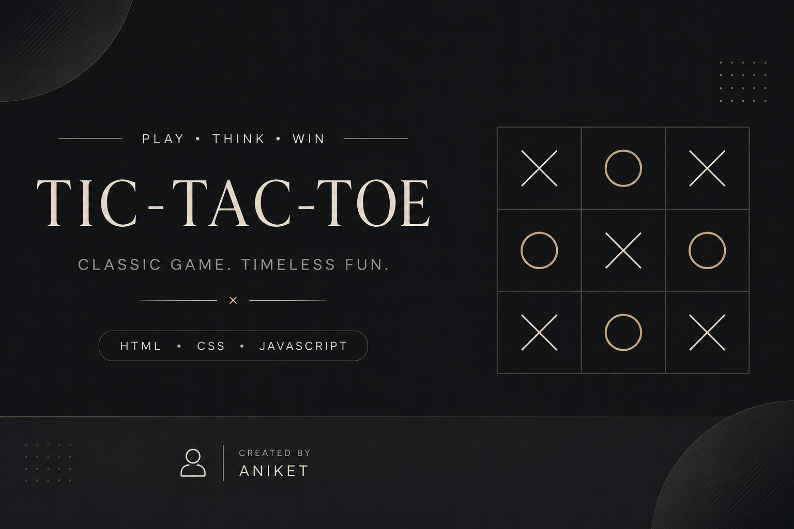
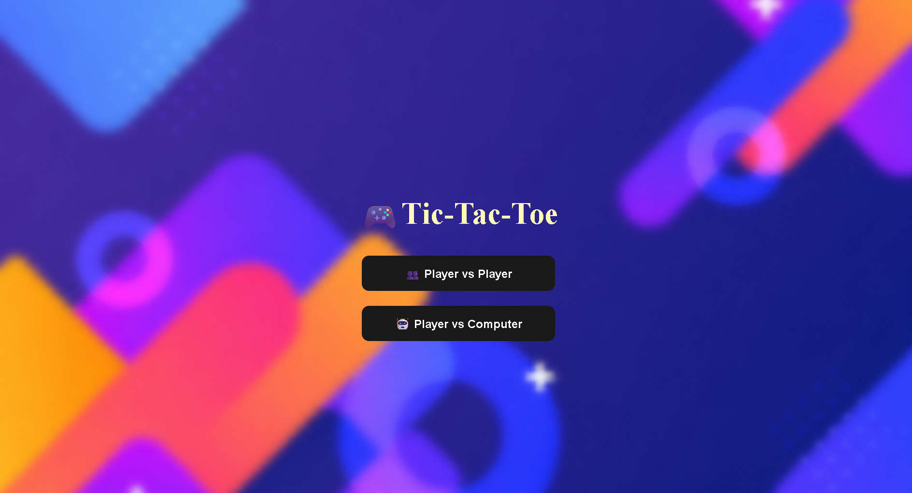
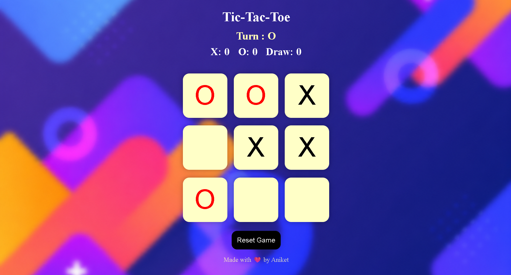
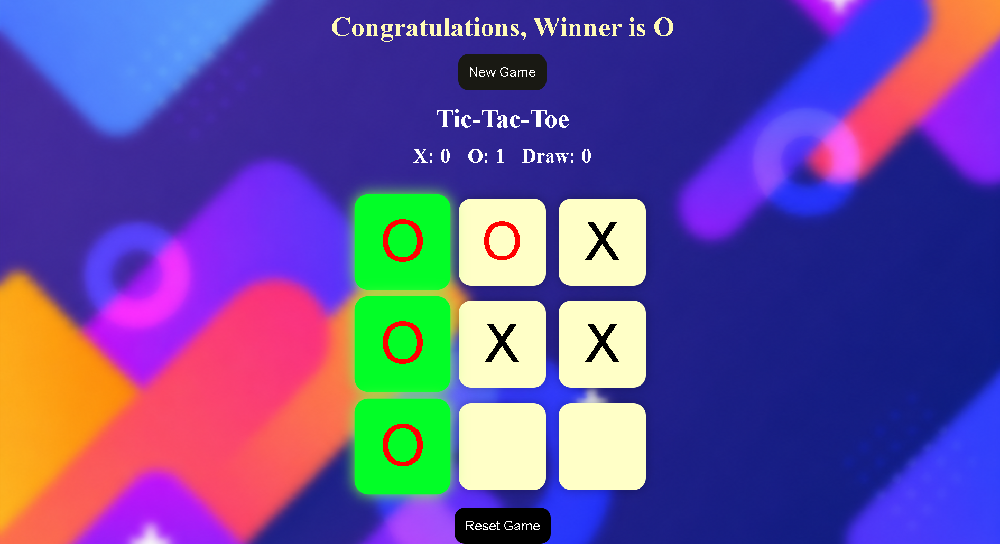
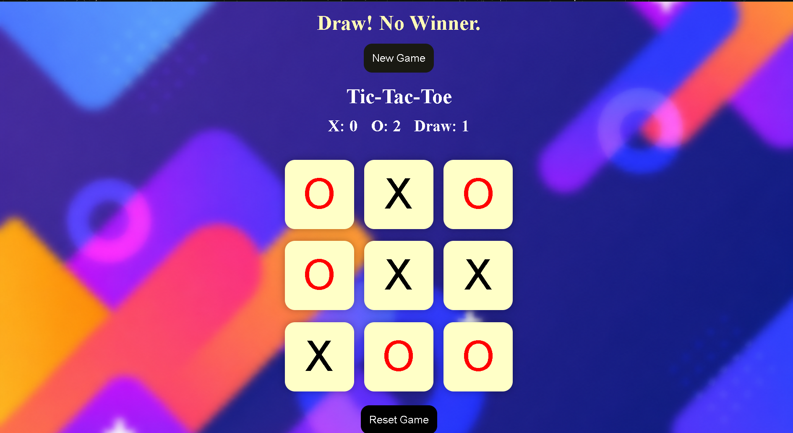
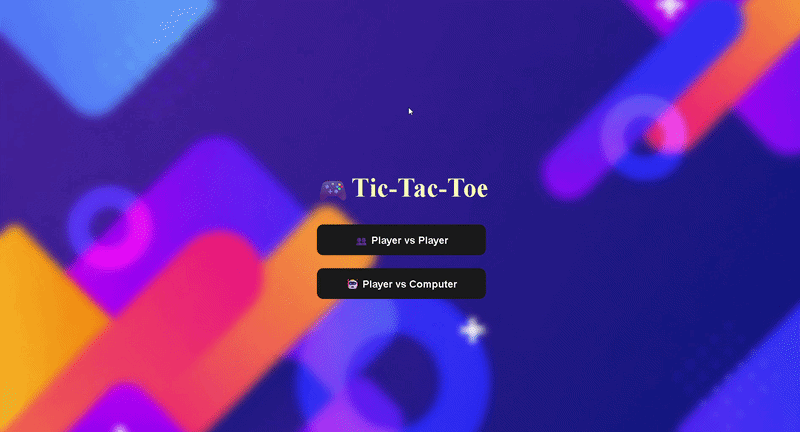

<p align="center">
  
</p>

<h1 align="center">🎮 Tic-Tac-Toe Game</h1>

<p align="center">
A modern, responsive, and interactive <b>Tic-Tac-Toe</b> game built using <b>HTML5</b>, <b>CSS3</b>, and <b>JavaScript</b>.
</p>

<p align="center">
Challenge your friends in <b>Player vs Player</b> mode or test your luck against the <b>Computer (Random AI)</b>.
</p>

<p align="center">
  
  
  
</p>

---

## 🌐 Live Demo

🔗 **Play Here:**  
https://aniketsinghh11.github.io/Tic-Tac-Toe-Game/

---

## 📸 Screenshots

### 🏠 Home Screen

<p align="center">
  
</p>

### 🎮 Gameplay

<p align="center">
  
</p>

### 🏆 Winner Screen

<p align="center">
  
</p>

### 🤝 Draw Screen

<p align="center">
  
</p>

---

## 🎥 Gameplay Demo

<p align="center">
  
</p>

---

## ✨ Features

- 🎮 Player vs Player (PvP) Mode
- 🤖 Player vs Computer (Random AI)
- 🏆 Automatic Winner Detection
- 🤝 Automatic Draw Detection
- 📊 Live Scoreboard
- 👤 Real-time Turn Indicator
- ✨ Winning Boxes Highlight
- 🔄 Reset Current Game
- 🆕 New Game Button
- 📱 Fully Responsive Design
- 🎨 Modern & Clean User Interface
- 🌄 Attractive Background Design
- ⚡ Smooth Hover Effects
- ⭐ Custom Favicon
- 🌐 Hosted on GitHub Pages

---

## 🛠️ Built With

- HTML5
- CSS3
- JavaScript (ES6)

---

## 📂 Project Structure

```text
Tic-Tac-Toe-Game/
│
├── assets/
│   ├── banner.png
│   ├── demo.gif
│   ├── home-screen.png
│   ├── gameplay.png
│   ├── winner-screen.png
│   └── draw-screen.png
│
├── favicon.png
├── img2.png
├── index.html
├── style.css
├── script.js
└── README.md
```

---

## 🚀 Getting Started

### Clone the repository

```bash
git clone https://github.com/aniketsinghh11/Tic-Tac-Toe-Game.git
```

### Run the project

Simply open the **index.html** file in your preferred web browser.

---

## 🎮 Game Rules

- ⭕ Player **O** always starts first.
- Match **three identical symbols** horizontally, vertically, or diagonally to win.
- If all **9 boxes** are filled without a winner, the game ends in a **Draw**.
- Use **Reset Game** to restart the current board.
- Use **New Game** to begin a fresh match after a game ends.

---

## 💡 Future Improvements

- 🧠 Smart AI using the Minimax Algorithm
- 🔊 Sound Effects
- 🎵 Background Music
- 🌙 Dark / Light Mode
- 🎉 Better Win Animations
- 🌍 Online Multiplayer
- 📈 Difficulty Levels (Easy / Medium / Hard)
- 🏆 Match History

---

## 🙋‍♂️ Author

### **Aniket**

🐙 GitHub: https://github.com/aniketsinghh11

If you like this project, don't forget to ⭐ **star the repository**!

---

<p align="center">
Made with ❤️ by <b>Aniket</b>
</p>
